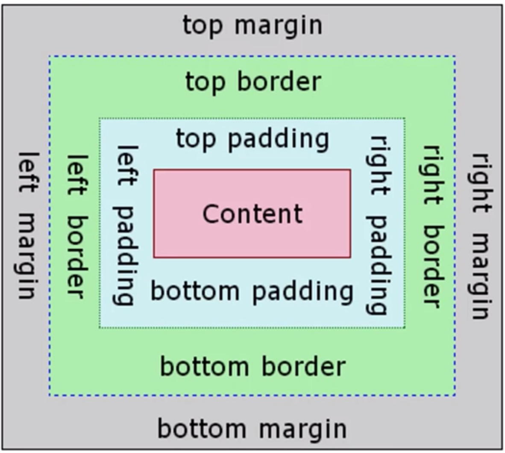

# CSS
* CSS = Cascading Stylesheet.
* CSS is not a programming language, but a styling language that are used for website design and layout.
* CSS3 is mostly used, which is an extention to the basic CSS. 

# CSS objects
* Styling for global objects using the name of the object.
```
body {
    background-color: rgb(240, 240, 240);
    color: #555;
    font-family: Calibri;
    font-size: 20px;
    line-height: 1.5em;
    margin: 0;
}
```
* Styling for classes are using "." notation.
```
.myContainers {
    width: 80%;
    margin: auto;
    overflow: hidden;
}
```
* Styling for id's are using "#" notation.
```
#myContainer1 {
    float: right;
    width: 30%;
    background: #333;
    color: #fff;
    padding: 10px;
    box-sizing: border-box;
}
```

# There are 3 methods of adding CSS:
* **Inline CSS**: Within the HTML code. (Bad practice). 
* **Internal CSS**: Using <style> tags within the HTML code. (Kind of bad practice).
* **Ex ternal CSS**: Linking to an external CSS file. (Best practice).

# Most used Units:
* px = pixel
* em = Relative unit
* fr = fractions

# Box Model


# Positioning:
* **Static (default)**: Render in order of the document flow.
* **Relative**: Relative to the normal position.
* **Absolute**: Target what position we want inside a relative element.
* **Fixed**: A fixed position to a browser window.
* **Initial**: Set property to default value.
* **Inherit**: will inherit from parent.
