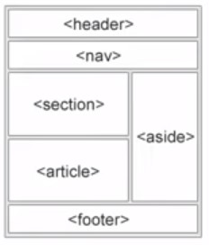

# HTML
*	Hypertext markup language (HTML). 
*	Not a programming language, but a markup language for websites and documents. 
*	HTML is the building block of the web. 

# TAG
* A tag is created using \<tagname\>. 
* Tags usually comes in pair: a starting tag \<\> and en ending tag \</tagname\>.  
* Self closing tags are single tags that have the slash “/” after the tagname, example \<tagname/\>. 

# HTML struture
```
<!DOCKTYPE html> #This tells the webpage what type of html to run. (html means HTML5). 

<html>

<head>
</head>

<body>
</body>

</html>
```

# Developer browser tools
* Open browser developer tools with (CMD + ALT + I) in chrome. Or just right-click --> inspect. 

# HTML Tag architecture

